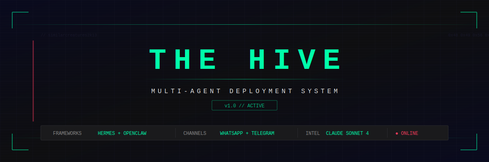

<div align="center">
  
</div>

---

## STATUS

Pre-v1. Active development starts after two upstream commitments clear
(Mnemosyne security audit, band hackathon). What lives here today is the
fixture corpus — production-shape multi-skill agent workflows the v1
tooling will run against.

## WHAT THIS BECOMES

The Hive will be a skill trigger diagnostic and behavioral telemetry layer
for Hermes Agent and OpenClaw. Two questions, one tool:

- Predictive: given a skill corpus and a set of realistic prompts, which
  skill should fire, which actually would, and which collide?
- Empirical: once skills are running, which one did fire, on what prompt,
  at what cost, with what outcome?

The gap between prediction and reality is where the useful findings live.
Skill authors don't currently have a way to test whether their description
actually triggers on the phrasings users send. Operators don't have a
clean view of which installed skills earn their context budget. The Hive
fills both.

## FIXTURE CORPUS

Production-shape workflows with real integrations (Google Calendar, Stripe,
multi-language flows). These exist as the dogfood corpus for the v1 trigger
diagnostic — realistic targets, not toy examples.

```text
   THE HIVE
   ├── skills/
   │   ├── restaurant-agent ────── Bookings, menu, upselling
   │   ├── real-estate-agent ───── Lead qualification, multilingual
   │   └── restaurant-agent-openclaw ── Cross-platform proof
   ├── tools/
   │   ├── calendar_tool.py ────── Google Calendar integration
   │   └── paywall/app.py ─────── Stripe subscription billing
   └── references/
       └── universe.json ──────── Sector intelligence (coming)
```

---

## AGENT ROSTER

### `SKILL:restaurant-agent`
*Framework: Hermes Agent*

Front-of-house AI that handles the entire reservation flow. Asks for party size, date, time, name, phone — then books it directly on Google Calendar. No human touches the booking.

- Reservation management with real calendar events
- Menu and dietary inquiries (halal, vegan, gluten-free)
- Natural upselling (sharing platters for groups, weekend specials)
- Complaint escalation to human manager
- 24/7 on WhatsApp + Telegram

```text
CUSTOMER: Hi, table for 4 Saturday at 7pm
AGENT:    Perfect. Name and phone number?
CUSTOMER: Johnson, 050-123-4567
AGENT:    Booked. Saturday 7pm, party of 4.
          Our sharing platters are great for groups — ask your server.
          [✓ Calendar event created]
```

### `SKILL:real-estate-agent`
*Framework: Hermes Agent*

Lead qualification engine that speaks English, Arabic, and French. Captures budget, timeline, area preference, and pre-approval status. Scores every lead as hot, warm, or cold.

- Buyer and seller qualification
- Multi-language (EN / AR / FR)
- Viewing bookings with calendar integration
- Automatic lead scoring
- Property matching against active listings

```text
CUSTOMER: مرحبا، أبحث عن شقة غرفتين نوم بميزانية 250 ألف
AGENT:    مرحبا! ما المنطقة المفضلة؟ وما الجدول الزمني للانتقال؟
          هل لديك موافقة مبدئية على التمويل؟
```

### `SKILL:restaurant-agent-openclaw`
*Framework: OpenClaw*

Same skill, different framework. Proves cross-platform deployment — one skill definition works on both Hermes and OpenClaw without rewriting.

---

## TOOLS

### `calendar_tool.py`
Direct Google Calendar API integration. No MCP middleware, no timeouts. Creates, lists, and deletes calendar events from the command line or agent skill.

```bash
python3 tools/calendar_tool.py create "Reservation - Smith, party of 4" "2026-06-01T19:00:00" 120
```

### `paywall/app.py`
Stripe subscription paywall for freemium AI chatbots. One free question, then $19.95/month unlimited access. Full Checkout + webhook flow.

```bash
STRIPE_SECRET_KEY=sk_test_xxx python3 tools/paywall/app.py
# → http://localhost:8080
# Test card: 4242 4242 4242 4242
```

```text
FREE QUESTION ──→ AI RESPONDS ──→ PAYWALL ──→ STRIPE CHECKOUT ──→ UNLIMITED
```

---

## DEPLOYMENT

```bash
# Install Hermes Agent
curl -fsSL https://raw.githubusercontent.com/NousResearch/hermes-agent/main/scripts/install.sh | bash

# Copy skills into Hermes
cp -r skills/restaurant-agent ~/.hermes/skills/
cp -r skills/real-estate-agent ~/.hermes/skills/

# Install OpenClaw
npm install -g openclaw@latest

# Copy OpenClaw skill
openclaw skills install skills/restaurant-agent-openclaw/

# Set up Google Calendar
pip3 install google-api-python-client google-auth-oauthlib
python3 tools/calendar_tool.py list-calendars

# Launch
hermes chat
```

---

## STACK

```text
FRAMEWORKS    Hermes Agent · OpenClaw
INTELLIGENCE  Claude Sonnet 4 (Anthropic)
MESSAGING     WhatsApp · Telegram
CALENDAR      Google Calendar API (direct)
PAYMENTS      Stripe Checkout + Subscriptions
LANGUAGES     English · Arabic · French
```

---

## ROADMAP

v1 — Skill trigger diagnostic
  - SKILL.md parser (frontmatter + body, Hermes and OpenClaw)
  - Prompt-set schema with expected-fire annotations
  - LLM-judge: ranked skill selection per prompt with confidence
  - Per-skill context cost + collision report
  - Markdown + JSON output, CI exit codes

v2 — Behavioral telemetry
  - Runtime tracer for Hermes and OpenClaw
  - SQLite trace store (Mnemosyne-compatible interface planned)
  - Prediction vs observation reconciliation reports

Out of scope: voice agents, CRM connectors, skill generation, security
scanning. Those are other people's lanes or other repos.
---

*Tetsuo Labs · 0xTetsuo*
